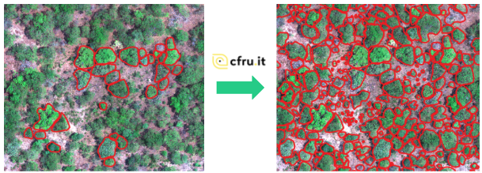

# AI for Trees
FruitPunch AI for Good challenge - AI for Trees

Monitoring tree coverage of regreening projects in Africa.
These notebooks are from the 'data' subteam, where the main focus was on improving the quality and quantity of the data available, this included tasks such as:
- manual labelling and quality assurance
- data augmentation
- image preprocessing

Link to the final blog post: https://www.fruitpunch.ai/blog/can-ai-track-reforestation-projects-using-drone-and-satellite-data

